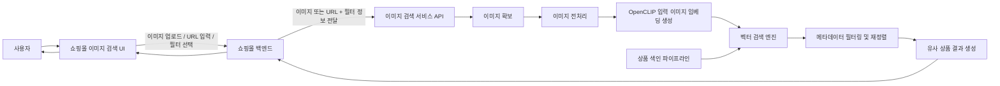
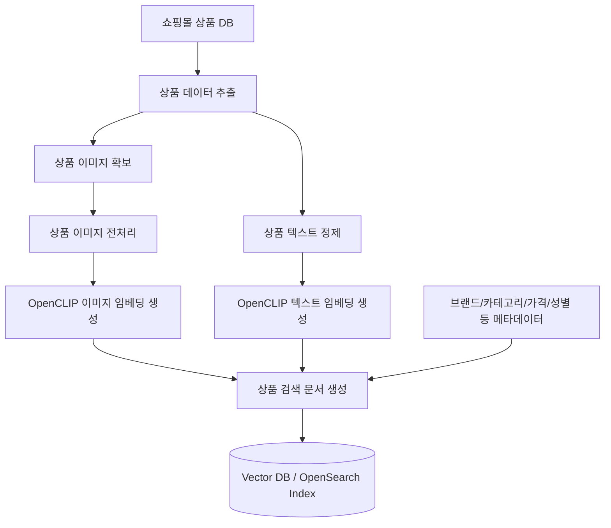
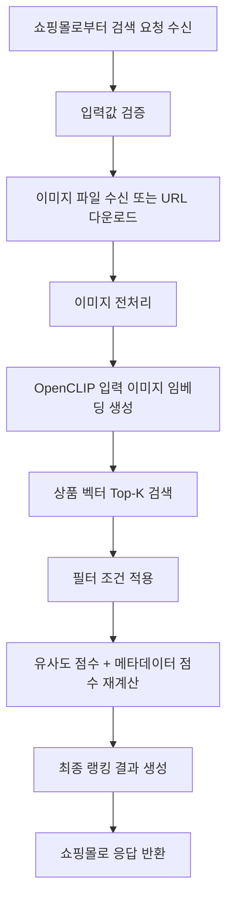
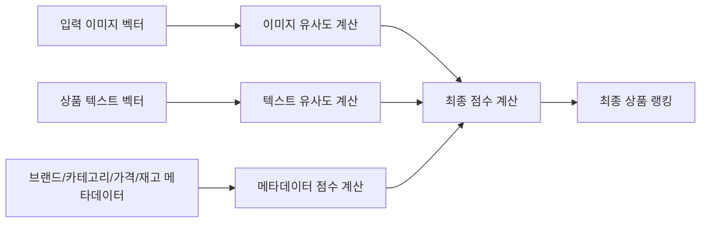
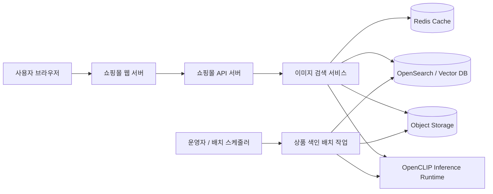
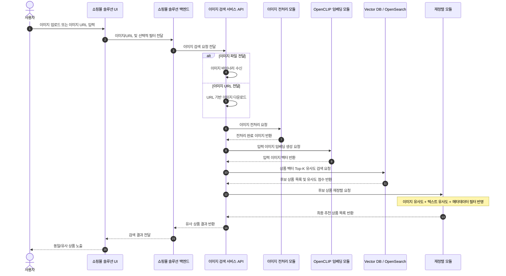
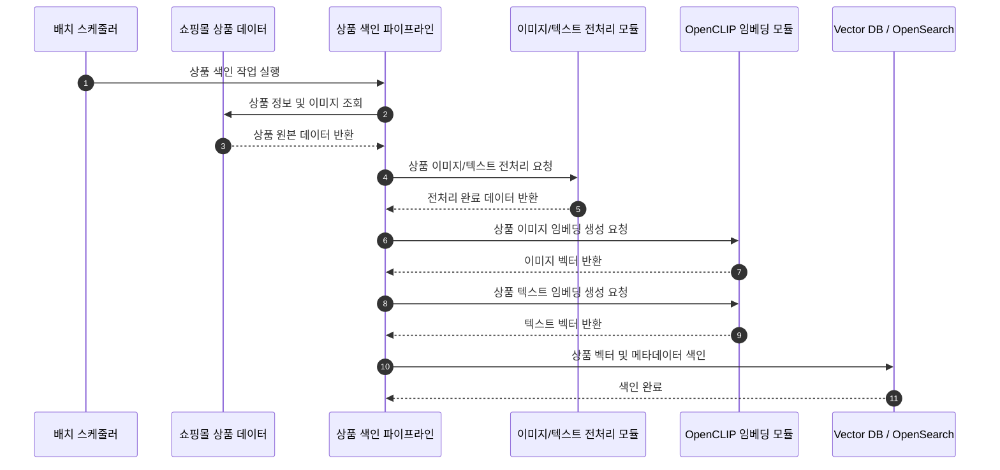

# 이미지 기반 상품 검색 서비스

상품 이미지를 입력받아 보유 상품 이미지와 비교하고, 동일하거나 유사한 상품을 추천 또는 검색하는 서비스입니다.

## 목표

- 사용자가 업로드한 이미지 또는 이미지 URL을 기준으로 유사 상품을 검색합니다.
- 상품 이미지, 상품 텍스트, 메타데이터를 함께 활용해 검색 정확도를 높입니다.
- OpenCLIP 기반 임베딩을 사용해 이미지와 텍스트를 같은 벡터 검색 흐름에서 처리합니다.

## 핵심 개념

### 벡터화

벡터화(Vectorization)는 이미지, 텍스트, 음성 같은 비정형 데이터를 숫자 배열 형태로 변환하는 과정입니다.

### 벡터화 방식

| 방식 | 설명 | 특징 |
| --- | --- | --- |
| 임베딩(Embedding) | 데이터의 의미, 관계, 맥락을 반영해 저차원 연속 벡터 공간에 표현하는 방식 | 의미 기반 검색, 추천, 유사도 비교에 적합 |
| 원-핫 인코딩(One-Hot Encoding) | 범주형 데이터를 0과 1로만 구성된 벡터로 표현하는 방식 | 단순하고 해석이 쉽지만 의미적 유사성은 반영하지 못함 |
| 카운트 벡터(Count Vector) | 문서나 문장에서 단어 등장 횟수를 숫자로 표현하는 방식 | 구현이 쉽지만 단어 순서와 문맥은 반영하지 못함 |
| 티에프 아이디에프(TF-IDF) | 문서 내 빈도와 전체 문서에서의 희소성을 함께 반영하는 방식 | 검색과 문서 분류에서 오래 쓰인 표준 방식 |
| 워드투벡(Word2Vec) | 단어를 의미적으로 비슷한 단어끼리 가까운 벡터가 되도록 학습하는 방식 | 단어 수준 의미 표현에 강함 |
| 패스트텍스트(FastText) | Word2Vec을 확장해 문자 단위 조각까지 고려하는 방식 | 희귀 단어, 오타, 형태 변화가 있는 언어에 상대적으로 유리함 |
| 독투벡 (Doc2Vec) | 문장이나 문서 전체를 하나의 벡터로 표현하는 방식 | 문서 단위 비교에 적합하지만 최근에는 Transformer 계열에 많이 대체됨 |
| 버트 임베딩 (BERT Embedding) | Transformer 기반으로 문맥까지 반영해 벡터를 생성하는 방식 | 문맥 이해 능력이 강하지만 계산 비용이 비교적 큼 |
| 센텐스 트랜스포머즈 (Sentence Transformers) | 문장 전체를 유사도 비교에 적합한 벡터로 만들도록 튜닝된 모델 계열 | 문장 검색과 의미 검색에 강함 |
| 이미지 임베딩(Image Embedding) | 이미지의 형태, 색상, 패턴, 질감 등을 반영한 벡터 표현 | 이미지 검색, 분류, 추천에 사용됨 |
| 멀티모달 임베딩(Multimodal Embedding) | 이미지와 텍스트처럼 서로 다른 데이터를 같은 공간에서 비교 가능하게 만드는 방식 | 이미지-텍스트 매칭, 커머스 검색에 적합 |

> <b>결론</b>  
> ※ 현재 진행하려는 서비스의 적절한 벡터화 방식은 멀티모달 임베딩 방식을 사용하는게 적절하다.

## 멀티모달 임베딩 모델

### CLIP

CLIP(Contrastive Language-Image Pretraining)은 이미지와 문장을 같은 좌표계에 놓고 학습한 신경망 모델입니다.

- 이미지와 텍스트를 같은 임베딩 공간에 매핑합니다.
- 이미지가 주어졌을 때 관련성이 높은 텍스트를 찾거나, 텍스트가 주어졌을 때 관련 이미지 검색에 활용할 수 있습니다.
- 참고 자료
  - <https://arxiv.org/abs/2103.00020>
  - <https://github.com/openai/CLIP>

### OpenCLIP

> <b>이 프로젝트에서는 OpenCLIP 사용을 우선합니다.</b>

- OpenAI CLIP의 오픈소스 재구현 모델.
- LAION 대규모 이미지-텍스트 데이터셋으로 재학습된 모델을 사용할 수 있습니다.
- 이미지 검색과 텍스트-이미지 매칭에 적합합니다.

> <b>LAION 이란?</b>  
> LAION(Large-scale Artificial Intelligence Open Network)은 독일 기반 비영리 AI 단체로, 대규모 이미지와 텍스트 데이터셋을 공개합니다.  
> - 데이터 구조: 이미지 URL + 텍스트 설명(Caption)  
> - 주요 규모:  
> - LAION-400M: 약 4억 개  
> - LAION-2B: 약 20억 개  
> - LAION-5B: 약 58억 개  

### 모델 후보

- <https://huggingface.co/openai/clip-vit-base-patch32>
- <https://huggingface.co/openai/clip-vit-large-patch14>
- <https://huggingface.co/patrickjohncyh/fashion-clip>

## 전체 서비스 흐름



## 상품 색인 파이프라인



## 이미지 검색 처리 흐름



## 랭킹 점수 계산



## 시스템 구성



## 검색 시퀀스



## 색인 시퀀스



## 프로토타입 구현 범위

### 원본 데이터 벡터화

- 파이썬 스크립트로 타깃 사이트 상품 정보 스크래핑
- 상품 정보 저장
- 상품 데이터 벡터화용 전처리
- 상품 이미지 및 텍스트 벡터화

### 이미지 검색 서비스

- 이미지 입력 엔드포인트 개발
- 이미지 데이터 전처리 기능 개발
- CLIP 모델을 위한 이미지 데이터 서빙 구조 개발
- 벡터 검색 결과에 대한 필터링 및 재정렬 기능 개발

## 멀티 벡터 구조

상품 검색 문서는 이미지 벡터, 텍스트 벡터, 메타데이터를 함께 갖는 멀티 벡터 구조로 설계합니다.

### 이미지 벡터

사용자 입력이 이미지이므로 이미지 벡터는 1차 검색의 핵심 정보입니다.

```bash
product_image_embeddings
- product_id
- image_type (main, sub, detail)
- image_url
- embedding
- model_name
- created_at
```

### 텍스트 벡터

텍스트 벡터는 보조 검색과 재정렬에 사용합니다.

- 브랜드, 상품명, 카테고리, 핵심 속성, 짧은 설명을 조합해 문장화합니다.
- 검색에 유효한 의미만 남기고 정규화된 문장으로 재구성합니다.
- 노이즈성 코드값은 제외하고 사람이 이해할 수 있는 상품 설명문으로 변환합니다.
- 식별자는 필터 또는 원본 DB에서만 관리합니다.

#### 문장 구성 규격

짧은 문장:

```text
브랜드 + 상품명 + 카테고리
```

중간 문장:

```text
브랜드 + 상품명 + 성별 + 카테고리 + 핵심 기능
```

확장 문장:

```text
브랜드 + 상품명 + 라인명 + 성별 + 카테고리 + 핵심 기능 + 검색 확장 표현
```

#### 예시

원본 상품 정보:

```text
URL: https://www.asics.co.kr/p/AKR_112610212-020
브랜드: 아식스
상품명: 젤 님버스 28 아식스트랙클럽
카테고리: Men>신발>러닝화
핵심 속성: 젤 님버스 28 아식스트랙클럽, 21833, ERP(112610212020), 1011C222020, 1011C222_020, 1011C222-020, GEL-NIMBUS28ATCMENSTANDARDGEL-NIMBUS28ASICSTRACKCLUB, 젤님버스28아식스트랙클럽, 남성러닝화, 남성런닝화, mensrunningshoes, 쿠션화
짧은 설명: 남성 신발
```

정제된 텍스트 임베딩 입력 예시:

```text
아식스 젤 님버스 28 아식스트랙클럽 남성 러닝화
아식스 젤 님버스 28 아식스트랙클럽 남성 쿠션 러닝화
아식스 젤 님버스 28 아식스트랙클럽 남성 러닝화, 쿠셔닝이 강조된 런닝 슈즈
```

## 사전 색인 단계

### 1. 쇼핑몰 상품 데이터 추출

- 상품 순번
- 상품명
- 브랜드
- 카테고리
- 색상
- 가격
- 상품 이미지 URL
- 상품 상세 설명
- 태그

### 2. 상품 이미지 전처리

대표 이미지와 서브 이미지를 대상으로 전처리합니다.

- 리사이즈
- 배경 제거
- 저품질 이미지 제거

### 3. 임베딩 생성

이미지 임베딩:

- 대표 이미지와 서브 이미지를 대상으로 생성합니다.
- 상품당 1~3장만 처리합니다.

텍스트 임베딩:

- 상품명
- 카테고리
- 브랜드
- 설명문
- 태그 조합 문장

### 4. 검색 문서 색인

- 이미지 벡터, 텍스트 벡터, 메타데이터를 하나의 상품 검색 문서로 구성합니다.
- Vector DB 또는 OpenSearch Index에 색인합니다.
- 검색 시 Top-K 후보를 가져온 뒤 필터와 메타데이터 점수를 반영해 최종 랭킹을 생성합니다.
