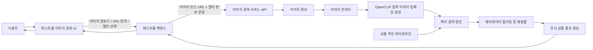
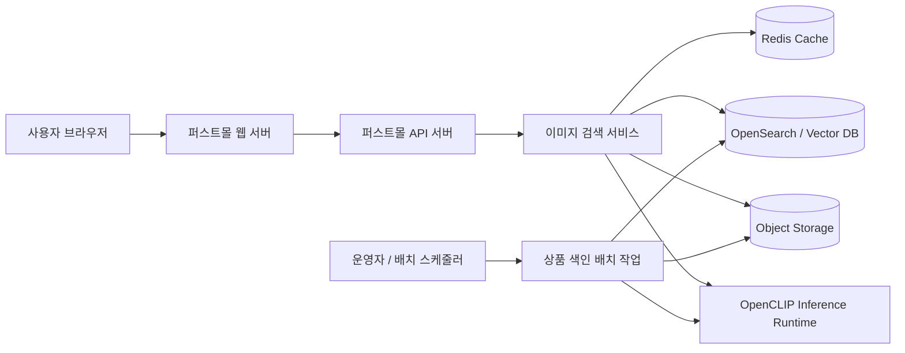

# 아키텍처

## 서비스 목표

- 사용자가 업로드한 이미지 또는 이미지 URL을 기준으로 유사 상품을 검색합니다.
- 상품 이미지, 상품 텍스트, 메타데이터를 함께 활용해 검색 정확도를 높입니다.
- OpenCLIP 기반 임베딩을 사용해 이미지와 텍스트를 같은 벡터 검색 흐름에서 처리합니다.

## 서비스 정의

상품 이미지를 입력받아 쇼핑몰이 보유한 상품 이미지 및 상품 정보를 기반으로 동일하거나 유사한 상품을 찾아주는 검색 서비스입니다.

## 핵심 처리 방향

- 사용자 입력은 이미지 또는 이미지 URL입니다.
- 현재 구현된 API는 이미지 URL 입력을 기본으로 합니다.
- 검색은 이미지 임베딩을 기준으로 시작합니다.
- 이후 상품 텍스트와 메타데이터를 함께 반영해 결과를 재정렬하는 방향으로 확장합니다.
- 최종적으로 쇼핑몰 UI에 유사 상품 목록을 반환합니다.

## 전체 서비스 구성도

## 컨테이너 구성도

## 현재 코드 계층

- `app/api`: FastAPI router와 endpoint
- `app/domain`: 상품, 카테고리, 이미지 검색 도메인 로직
- `app/infra`: DB, OpenSearch, CLIP, 외부 API adapter
- `app/core`: 설정, 로깅, 보안, DB 공통 설정
- `app/common`: 공통 예외, 응답, 유틸
- `app/jobs`: 상품 색인과 재색인 같은 배치 작업
- `migrations`: Alembic 마이그레이션

## 인프라

로컬 개발 기본 구성은 API, OpenSearch, Redis입니다. OpenSearch는 벡터 검색 인덱스를 담당하고, Redis는 캐시나 비동기 작업 큐 도입 시 사용합니다.
