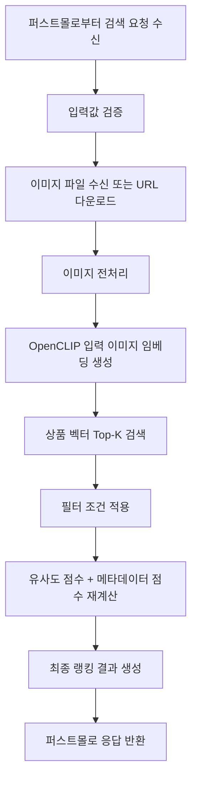
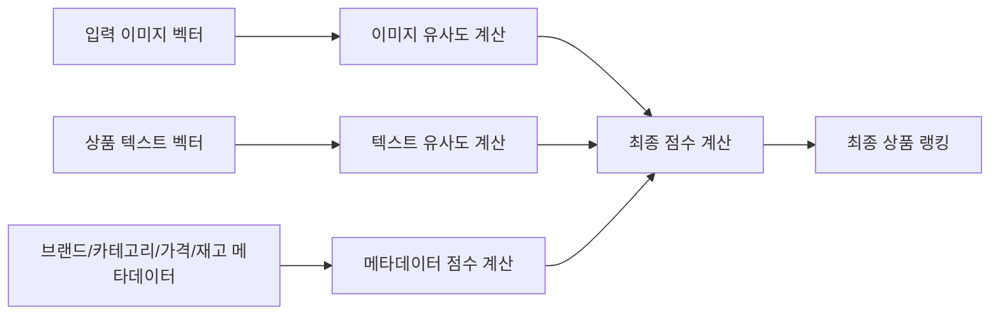
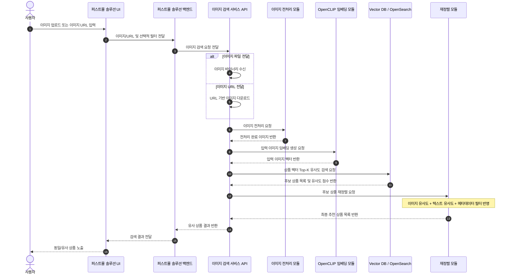

# 이미지 검색 흐름

## 목적

사용자가 입력한 이미지 또는 이미지 URL을 기준으로 유사 상품 후보를 찾고, 필터와 메타데이터 점수를 반영해 최종 검색 결과를 반환합니다.

현재 구현된 API는 `image_url` 요청을 받는 최소 엔드포인트입니다. 이미지 파일 업로드, 실제 CLIP 임베딩 생성, OpenSearch 검색, 재정렬은 설계 및 개발 예정 흐름입니다.

## 이미지 검색 기능 흐름

## 개발 항목

- 이미지 입력 엔드포인트 개발
- 이미지 데이터 전처리 기능 개발
- CLIP 모델을 위한 이미지 데이터 서빙 구조 개발
- 벡터화 정보에 기반한 상품 검색 기능 개발

## 최종 점수 계산

## 검색 시퀀스

