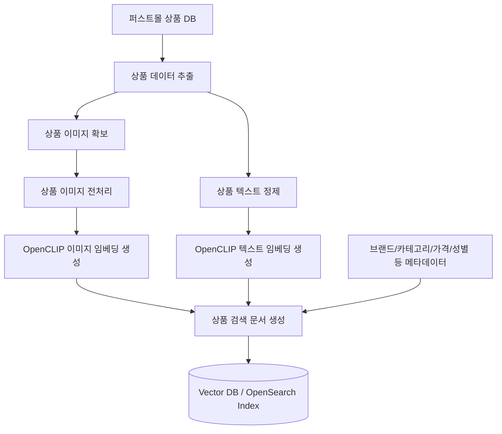
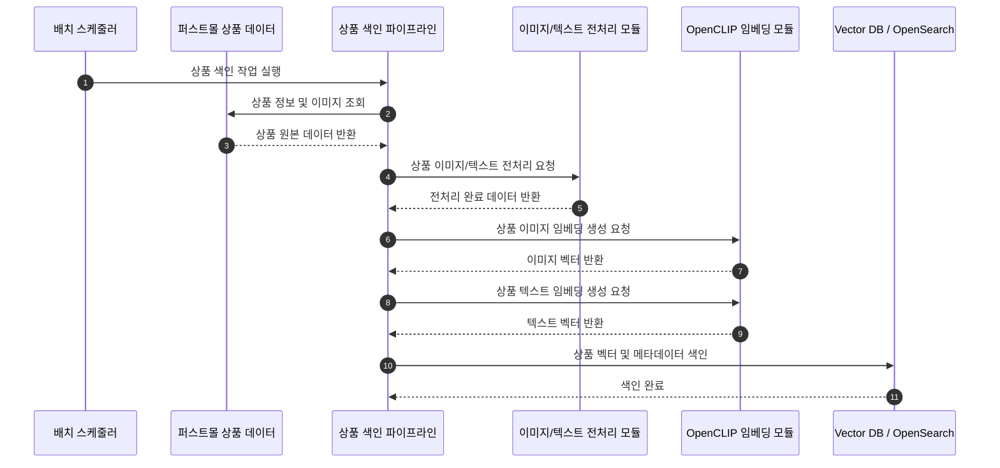

# 상품 색인 파이프라인

## 목적

상품 데이터를 이미지 검색에 사용할 수 있도록 이미지 벡터, 텍스트 벡터, 상품 메타데이터를 생성해 OpenSearch 인덱스에 저장합니다.

현재 코드는 배치 진입점과 adapter 경계만 갖고 있으며, 실제 스크래핑, 전처리, 벡터화, 색인은 설계 방향입니다.

## 상품 색인 파이프라인 구성도



## 사전 색인 파이프라인



## 상품 정보 스크래핑

파이썬 스크립트 또는 외부 API 연동으로 다음 상품 정보를 수집합니다.

- 상품 순번
- 상품명
- 브랜드
- 카테고리
- 색상
- 가격
- 상품 이미지 URL
- 상품 상세 설명
- 태그

## 상품 정보 저장

원본 상품 데이터는 추후 재색인, 디버깅, 품질 비교를 위해 원본 DB 또는 별도 저장소에 보존합니다. 검색 인덱스에는 원본 식별자, 검색용 텍스트, 이미지 URL, 벡터, 주요 필터 메타데이터를 저장합니다.

## 이미지 벡터

이미지는 사용자 입력이 이미지이므로 1차 검색의 핵심 정보입니다.

구성 예시:

```text
product_image_embeddings
- product_id
- image_type (main, sub, detail)
- image_url
- embedding
- model_name
- created_at
```

전처리 과정:

- 리사이즈
- 배경 제거
- 저품질 이미지 제거

## 텍스트 벡터

텍스트 벡터는 보조 검색과 재정렬에 사용합니다.

다음 정보를 조합해 검색에 유효한 의미만 남긴 문장으로 재구성합니다.

- 브랜드
- 상품명
- 카테고리
- 핵심 속성
- 짧은 설명

노이즈성 코드 값은 검색 문장에서 제외하고, 사람이 이해할 수 있는 상품 설명문으로 바꿉니다. 식별자는 필터나 원본 DB에만 유지합니다.

문장 구성 규격:

```text
브랜드 + 상품명 + 카테고리
```

```text
브랜드 + 상품명 + 성별 + 카테고리 + 핵심 기능
```

```text
브랜드 + 상품명 + 라인명 + 성별 + 카테고리 + 핵심 기능 + 검색 확장 표현
```

상품 정보 예시:

```text
URL: https://www.asics.co.kr/p/AKR_112610212-020
브랜드: 아식스
상품명: 젤 님버스 28 아식스트랙클럽
카테고리: Men>신발>러닝화
핵심 속성: 젤 님버스 28 아식스트랙클럽,21833,ERP(112610212020),1011C222020,1011C222_020,1011C222-020,GEL-NIMBUS28ATCMENSTANDARDGEL-NIMBUS28ASICSTRACKCLUB,젤님버스28아식스트랙클럽,남성러닝화,남성런닝화,mensrunningshoes,쿠션화
짧은 설명: 남성 신발
```

문장화 데이터 예시:

```text
아식스 젤 님버스 28 아식스트랙클럽 남성 러닝화
```

```text
아식스 젤 님버스 28 아식스트랙클럽 남성 쿠션 러닝화
```

```text
아식스 젤 님버스 28 아식스트랙클럽 남성 러닝화, 쿠셔닝이 강조된 런닝 슈즈
```

## 상품 데이터 벡터화

멀티 벡터 방식으로 이미지와 텍스트 정보를 CLIP 모델을 활용해 벡터화합니다.

- 이미지 임베딩
  - 대표 이미지 / 서브 이미지
  - 상품당 1~3장 처리
- 텍스트 임베딩
  - 상품명
  - 카테고리
  - 브랜드
  - 설명문
  - 태그 조합 문장
